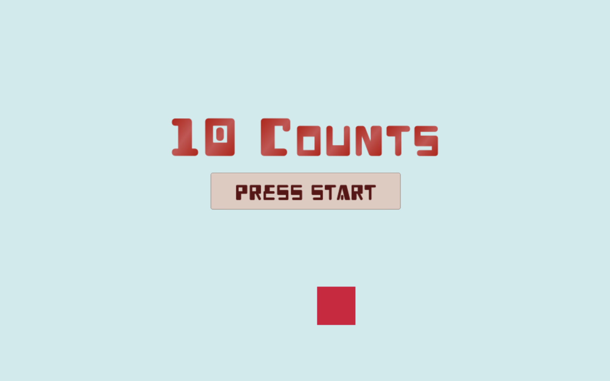

# TenCounts

10秒ずつのカウントを聴きながら，上から落ちてくるものをPCの左右矢印キーで避け続けて，高いレベルを目指しましょう．   
DOTweenの練習用に作りました．[unityroom](https://unityroom.com/games/10counts)でプレイ可能です．

また，解説記事を[UT-virtual Advent Calendar](https://qiita.com/advent-calendar/2018/ut-virtual)に投稿しています．
