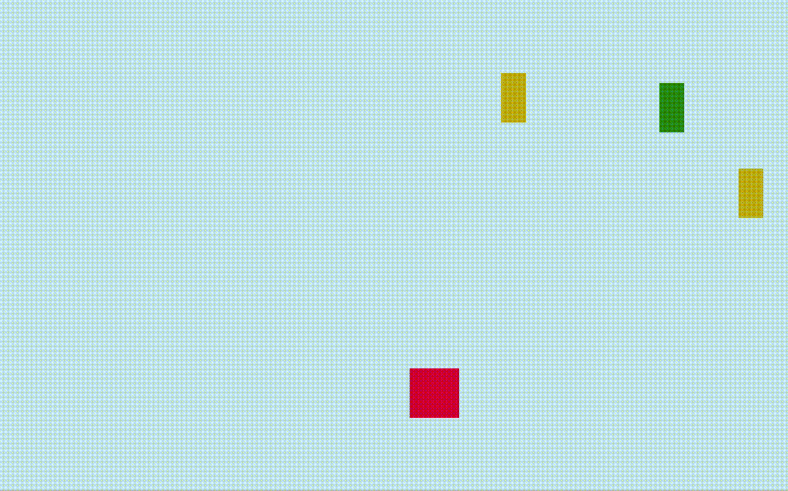

# TenCounts

10秒ずつのカウントを聴きながら，上から落ちてくるものをPCの左右矢印キーで避け続け，高いレベルを目指しましょう．   
DOTweenの練習用に作りました．[unityroom](https://unityroom.com/games/10counts)でプレイ可能です．

また，[解説記事](https://qiita.com/radi_bow/items/063b95fad8b95e030b99)をQiitaに投稿しています．
